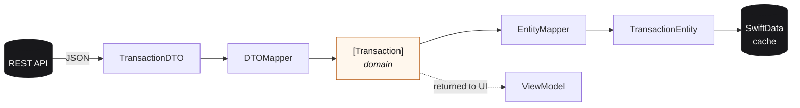
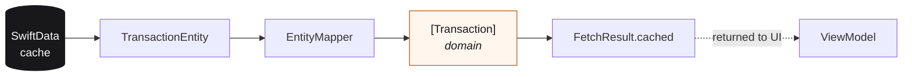
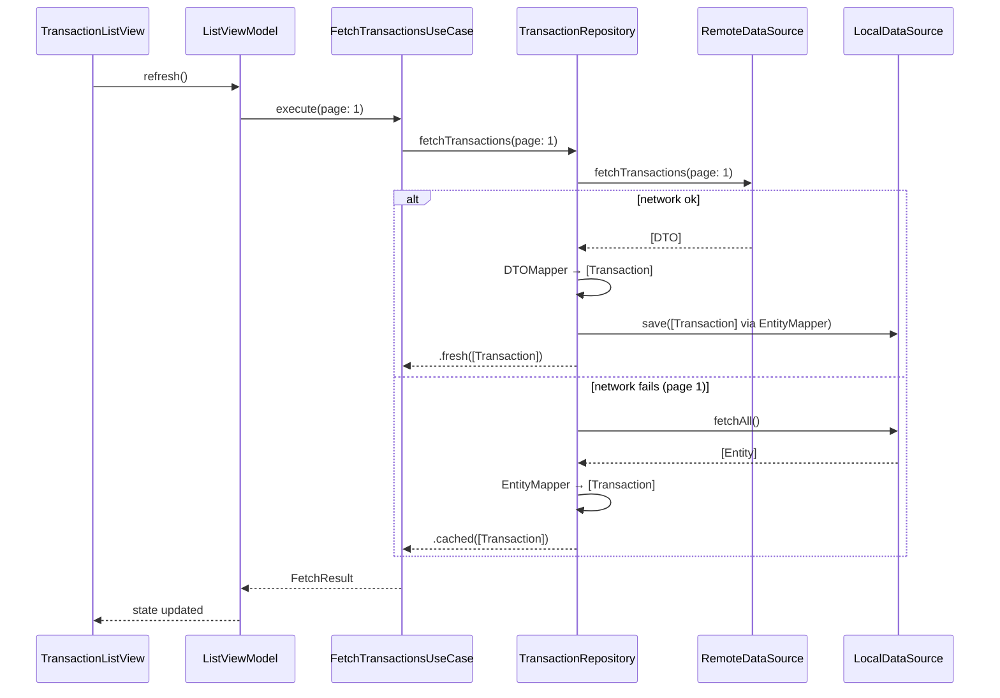

# Architecture

Clean Architecture for an iOS transaction-list feature. Four layers, dependencies flow inward, wired at the composition root via constructor injection.

## Overview

```mermaid
flowchart TB
    DIC["DIContainer<br/><i>Composition Root</i>"]

    subgraph UI["① UI Layer — Presentation"]
        direction TB
        TLV["TransactionListView"]
        TRV["TransactionRowView"]
        TLVM["TransactionListViewModel<br/><i>@Observable</i>"]
        TRVM["TransactionRowViewModel"]
        SV["ErrorView · LoadingView<br/>OfflineBannerView"]
    end

    subgraph Domain["② Domain Layer — Business Logic"]
        direction TB
        FTUCp>"FetchTransactionsUseCaseProtocol<br/><i>«protocol»</i>"]
        FTUC["FetchTransactionsUseCase"]
        TRPp>"TransactionRepositoryProtocol<br/><i>«protocol»</i>"]
        Tx["Transaction<br/><i>domain model</i>"]
        FR["FetchResult<br/><i>.fresh / .cached</i>"]
        Enums["TransactionSide · TransactionStatus<br/>OperationMethod · OperationType · ActivityTag<br/><i>enums</i>"]
    end

    subgraph Data["③ Data Layer — Repository, Mappers, Data Sources"]
        direction TB
        TR["TransactionRepository"]
        DTOM["TransactionDTOMapper<br/><i>DTO → Domain</i>"]
        EM["TransactionEntityMapper<br/><i>Entity ↔ Domain</i>"]
        RDSp>"TransactionRemoteDataSourceProtocol<br/><i>«protocol»</i>"]
        RDS["TransactionRemoteDataSource"]
        LDSp>"TransactionLocalDataSourceProtocol<br/><i>«protocol»</i>"]
        LDS["TransactionLocalDataSource"]
        DTO["TransactionDTO"]
        ENT["TransactionEntity<br/><i>@Model</i>"]
    end

    subgraph Core["④ Core Layer — Infrastructure"]
        direction TB
        NSp>"NetworkServicing<br/><i>«protocol»</i>"]
        HC["URLSessionHTTPClient"]
        PSp>"PersistenceServicing<br/><i>«protocol»</i>"]
        PS["SwiftDataPersistenceService"]
        PC["PersistenceController<br/><i>ModelContainer factory</i>"]
        AE["APIEndpoint"]
        NM["NetworkMonitor<br/><i>NWPathMonitor, @Observable</i>"]
        Errors["NetworkError<br/>PersistenceError"]
    end

    API[("REST API")]
    SD[("SwiftData")]

    %% Composition root wiring
    DIC -.injects.-> UI
    DIC -.injects.-> Domain
    DIC -.injects.-> Data
    DIC -.injects.-> Core

    %% UI internal + UI → Domain
    TLV --> TLVM
    TRV --> TRVM
    TLVM -- uses --> FTUCp

    %% Domain internal
    FTUC == implements ==> FTUCp
    FTUC -- uses --> TRPp

    %% Data implements Domain ports
    TR == implements ==> TRPp
    RDS == implements ==> RDSp
    LDS == implements ==> LDSp

    %% Data internal
    TR -- uses --> RDSp
    TR -- uses --> LDSp
    TR -- uses --> DTOM
    TR -- uses --> EM
    DTOM -- maps --> DTO
    EM -- maps --> ENT

    %% Data → Core
    RDS -- uses --> NSp
    RDS -- uses --> AE
    LDS -- uses --> PSp
    HC == implements ==> NSp
    PS == implements ==> PSp
    PS -- uses --> PC

    %% Core → External
    HC --> API
    PS --> SD

    classDef layerUI     fill:#f5f5f4,stroke:#27272a,color:#18181b
    classDef layerDomain fill:#fafaf9,stroke:#27272a,color:#18181b
    classDef layerData   fill:#f5f5f4,stroke:#27272a,color:#18181b
    classDef layerCore   fill:#fafaf9,stroke:#27272a,color:#18181b
    classDef external    fill:#18181b,stroke:#18181b,color:#fafaf9

    class API,SD external
```



> **Legend** — Flag-shaped nodes (`>`…`]`) are **protocols**. Rectangles are **concrete types**. Cylinders are **external systems**. Thick `==>` arrows mean *implements*; thin `-->` arrows mean *uses / depends on*; dotted `-.->` arrows are *injection*.

---

## Dependency rule

Outer layers depend on inner layers, never the reverse.

```
UI ──▶ Domain ◀── Data ──▶ Core ──▶ (REST API, SwiftData)
```

The **Domain layer** imports nothing from Data or Core. It is pure Swift: models, use-cases, and the `TransactionRepositoryProtocol` port. The concrete `TransactionRepository` lives in Data and implements that port — classic dependency inversion.

---

## Data flow — online (network-first)



1. Remote fetch succeeds.
2. `TransactionDTO` is decoded from JSON.
3. `DTOMapper` converts DTO → `[Transaction]`.
4. `EntityMapper` converts `[Transaction]` → `TransactionEntity` and writes through to SwiftData.
5. Domain array is returned to the ViewModel as `FetchResult.fresh`.

## Data flow — offline fallback (page 1 only)



The repository only falls back to cache when **page == 1**. Paginated requests that fail mid-scroll fail silently — existing data stays on screen and the user can scroll again or pull-to-refresh.

---

## Control flow — a pull-to-refresh



---

## Module layout

```
App/
├── Core/
│   ├── Networking/         URLSessionHTTPClient, NetworkServicing, APIEndpoint, NetworkMonitor, NetworkError
│   ├── Persistence/        SwiftDataPersistenceService, PersistenceServicing, PersistenceController, Persistable, PersistenceError
│   └── Logging/            QontoLogger (OSLog wrapper)
├── Data/
│   ├── Repositories/       TransactionRepository
│   ├── Mappers/            TransactionDTOMapper, TransactionEntityMapper, MappingError
│   ├── Remote/             TransactionRemoteDataSource (protocol + concrete)
│   ├── Local/              TransactionLocalDataSource (protocol + concrete), TransactionEntity
│   └── DTOs/               TransactionResponse (TransactionDTO)
├── Domain/
│   ├── Models/             Transaction + enums
│   ├── UseCases/           FetchTransactionsUseCase
│   └── Repositories/       TransactionRepositoryProtocol
├── UI/
│   ├── TransactionList/    TransactionListView, TransactionListViewModel
│   ├── TransactionRow/     TransactionRowView, TransactionRowViewModel
│   └── Components/         ErrorView, LoadingView, OfflineBannerView
└── DIContainer.swift
```

